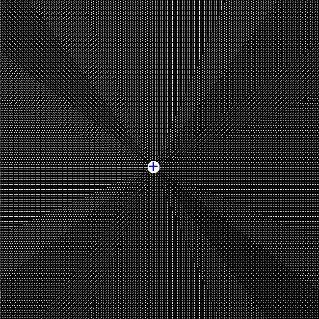

# Electric-Field-Simulation

This is a simulation of an electric field with an arbitrary number of charges with Java Graphics and discrete [vector fields](https://en.wikipedia.org/wiki/Vector_field). 

Instructions:
* Press the 'r' key to restart
* Use the scroll wheel to change the resolution of the vector field
* Move the charges by clicking and dragging them

___

Physics:

The magnitude of the electric field at a specific point caused by a charge is calculated with the following equation

    

Where\
$Q$ is the charge magnitude in Coulombs ($C$)\
$k$ is Coulombs constant (doesn't matter for this simulation)\
$d$ is the distance between the point and the charge

The individual vector components are then calculated:
$$E_x=E\cos{\theta} = E\frac{d_x}{d}$$
$$E_y=E\sin{\theta} = E\frac{d_y}{d}$$

Where $\theta$ would be the angle created between the charge and the point.

Electric fields for single charges should look like this:

And as you can see, when you increase the resolution in my simulator, you start to see a similar pattern:

___

It looks like this when the vector field is dense: 

And like this when less dense:

